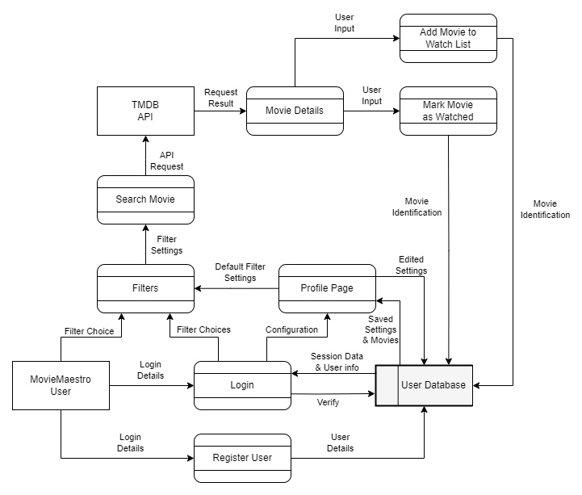

# MovieMaestro

# Table of Contents

## [R1	Description of your website](#r1)
## [R2	Dataflow Diagram](#r2)
## [R3	Application Architecture Diagram](#r3)
## [R4	User Stories](#r4)
## [R5	Wireframes for multiple standard screen sizes](#r5)
## [R6	Screenshots of your Trello board](#r6)

## R1	Description of your website {#r1}
### Purpose
Do you ever struggle to pick a movie you want to watch? Do you spend hours scrolling through different streaming platforms just to settle on a movie that isn't what you felt like watching? Well say no more! MovieMaestro is an application that saves you time and helps you identify what you want to watch, quickly! By using a variety of Filters, MovieMaestro will select a movie for you to watch so you can go to your streaming platform after and put it straight on! 

The purpose of MovieMaestro is to save you time and get you relaxing and watching the movies you want to watch as soon as possible. By selecting through the many filter options on MovieMaestro, it will direct you to a movie tailored to your wants. This means less time wasted in picking a movie, which means more time for relaxation and entertainment!

### Functionality and Features
- Users can apply filters that will identify a movie to be displayed. This could include but not limited too: genre, streaming service availability, country availability, include/disclude keywords, title, average vote, etc.
- Users can create and register an account on Movie Maestro. They can add user information that will help add defaults to their movie search. For example only requesting movies in their language such as English or Japanese.
- Once the filters have been applied, MovieMaestro will display a movie for the user, the user can choose to accept the movie choice or refresh the search and they can add movies to their "watched list" to exclude it from new searches in the future.

### Target Audience
MovieMaestro is designed for people who love movies who often notice themselves having some struggle in selecting a movie from a vast selection available on streaming platforms. It helps people who struggle with indecision when it comes to choosing what to watch and assists in streamlining the process of finding a movie that fits their preferences or mood.

Whether you are a casual viewer looking for a quick movie recommendation or a movie lover seeking a curated suggestion, MovieMaestro aims to simply the movie selection experience. This application is ideal for anyone who values their time and wants to spend more time watching movies and less time picking one to watch! 

### Tech Stack
Our application is created using the MERN stack which consists of:
- MongoDB - A popular database which is document orientated and utilises NoSQL and JSON-like documents as our data.
- Express - A minimalistic Node.js application framework primarily used for routing and middleware(Our backend API).
- React - React is a very powerful Javascript library that allows us to create a dynamic and interactive user-interface(Our Front-end).
- Node.js - Node is a Server-side JavaScript run-time environment it works with Express to enhance functionality of our application by enabling server-side processing.

Other Tech used in our application includes:
- Mongoose
- Vite
- HTML 
- CSS
- Vitest and test-library
- SuperTest

## R2	Dataflow Diagram {#r2}

## R3	Application Architecture Diagram {#r3}

## R4	User Stories {#r4}
## R5	Wireframes for multiple standard screen sizes {r5}
## R6	Screenshots of your Github Projects {#r6}

